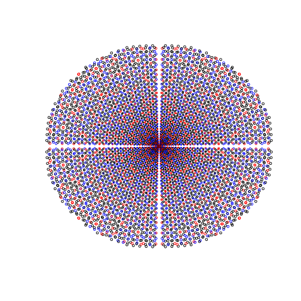

Talking with David and Ben about simple, mathy programs that make nice pictures (for pedagogical reasons).

David suggested something about the Pythagorean triples. He said to reduce them to rationals, but I couldn't figure out a good way to do that (the natural way just produces points on a circle).

Here are (a, b) from Pythagorean triples, for $$c\leq50$$. The circles get bigger at rate $$\sqrt{c}$$. The box goes from (-50, 50) on each axis.

